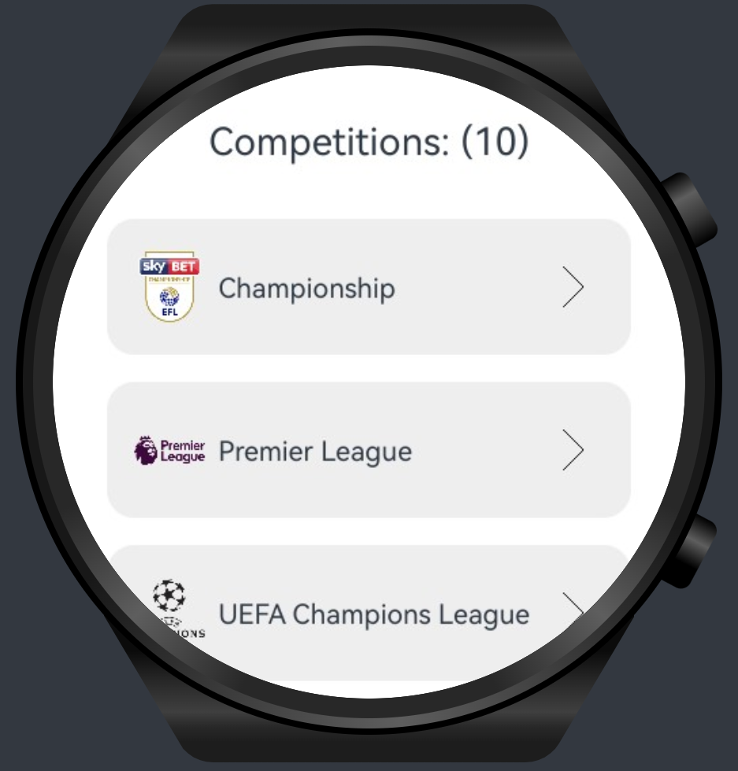
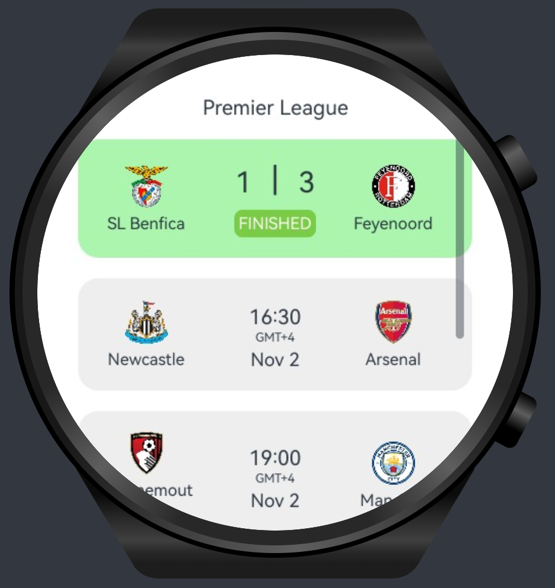
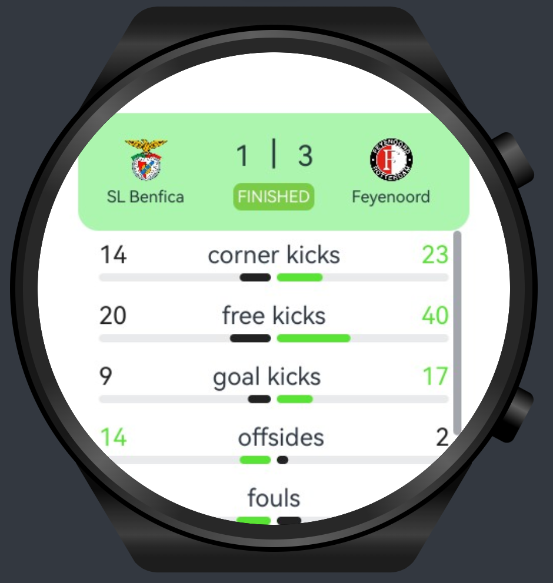

# Football App Demo for HarmonyOS NEXT (ArkTS/ArkUI)

This is a demo project developed for Huawei smartwatches using HarmonyOS NEXT (ArkTS/ArkUI). The app features three main screens which are football competitions screen, competition upcoming matches, and match details/statistics screen.

## Features

### Competitions

Displays a list of football competitions such as the Champions League, Premier League, and more.



### Matches

This screen provides a schedule of upcoming matches within the selected competition for the next 30 days. Completed matches are highlighted in green and can be tapped to view match statistics.



### Match Details

The match details screen shows score and statistics, including metrics like ball possession, offsides, and other stats.



## Prerequisites

- **DevEco Studio NEXT**: Required to build and run the HarmonyOS NEXT project.
- **API Key**: You'll need to get an API key from [football-data.org](https://www.football-data.org/) to fetch data about leagues, matches, and statistics.

## Setup

1. **Clone the repository**:

   ```bash
   git clone https://github.com/megaacheyounes/football-harmonyos-next-wearable.git
   cd football-app-demo
   ```

2. **Get the API Key**:

   - Sign up at [football-data.org](https://www.football-data.org/) and obtain an API key.

3. **Add the API Key**:

   - Insert your API key into the project file `Repo.ets` where it’s referenced.

4. **Open in DevEco Studio NEXT**:

   - Open DevEco Studio NEXT and import the project.

5. **Run the App**:
   - Connect your Huawei smartwatch or use the simulator in DevEco Studio NEXT, then run the app.

 
## Technologies Used

- **HarmonyOS NEXT**: Huawei's new development platform using ArkTS (based on typescript)
- **API**: [football-data.org](https://www.football-data.org/) API for fetching competition, match, and statistics data.

## License

```txt
               DO WHAT YOU WANT TO PUBLIC LICENSE

Copyright (C) 2024 Younes Megaache

Everyone is permitted to copy and distribute verbatim or modified
copies of this license document, and changing it is allowed as long
as the name is changed.

                DO WHAT YOU WANT TO PUBLIC LICENSE

TERMS AND CONDITIONS FOR COPYING, DISTRIBUTION AND MODIFICATION

1. You just DO WHAT YOU WANT TO.
```
